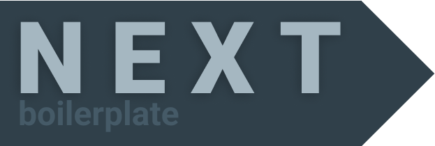

   

# NEXT boilerplate
Template for Frontend with NextJS, ReactJS & SASS.

## Usage
Run `npm install` for Install all dependencies.

### Development
Run `npm run dev` for wake up *server* and go to `localhost:3000`

### Build
Run `npm run build` for generate builds.

### Start
Run `npm run start` for wake up server on `localhost:3000`.

### Linter
Run `npm run lint` for scan all project and get standards-based code review on javascript and sass tecnologies.

---

#### Author
© Copyright Felipe Randolfi
